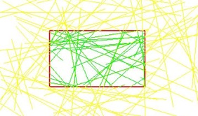

# 山东大学计算机图形学实验 2021 秋季学期
## 实验一 直线与画圆算法
* 实现DDA和Bresenham画线算法。(80%)
- 实现画圆算法（中点法）。(90%)
- 可通过交互操作确定线段的起点和终点。(100%)
## 实验二 裁剪算法
* 实现Liang-Barsky裁剪算法，绘制任意方向/数量线段，可移动的裁剪窗口，通过不同颜色标识裁剪窗口内外的部分，效果可参考下图（可交互的移动裁剪窗口并实时显示裁剪效果）。(100%)

- 画线的命令可以使用OpenGL提供的画线函数，也可以使用实验一自己实现的画线函数。
## 实验三 光栅化与消隐
* 在屏幕上绘制两个不同的图形(用不同颜色区分)，实现x扫描线填充（使用活性边表结构)。(60%)
- 利用Z-buffering算法实现离视点更近的图形显示在上层。（90%）
- 使用反走样技术处理图像边缘的锯齿感，可生成图片格式放大查看效果。（100%）
## 实验四 Bezier曲线与B样条
* 实现 de Casteljau 算法来绘制使用不同数量的控制点表示Bézier 曲线。（40%）
- 基于de boor 割角算法来绘制使用不同数量的控制点表示B样条曲线。（80%）
- 支持insert/delete/move控制点，同时画出控制顶点/控制多边形/样条曲线。（100%）
## 实验五 OFF文件读取与半边数据结构
* 读取OFF文件转化为半边数据结构，并绘制在屏幕上（30%）
- 给定任一顶点索引，改变该顶点相邻顶点的颜色为红色，改变以该顶点为端点的边颜色为蓝色。（70%）
- 实现鼠标/键盘交互操作（平移，旋转，缩放）（80%）
- 实现任意一种三模模型的细分或简化算法（100%）
## 实验六 光照模型
* 加载三维模型，实现法向量、颜色、纹理颜色的插值(40%)。
- 实现 Blinn-Phong光照模型(90%)。
- 在实现 Blinn-Phong 的基础上，将纹理颜色视为公式中的 kd，实现 Texture Shading Fragment Shader(100%)。